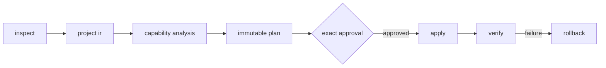

<p align="center">
  
</p>

<h1 align="center">pkgshift</h1>

<p align="center">
  Transactional package manager migrations for JavaScript repositories.
</p>

<p align="center">
  <a href="https://github.com/bahadirarda/pkgshift/actions/workflows/ci.yml"></a>
  
  
  
</p>

<p align="center">
  Inspect the repository. Review an immutable plan. Approve the exact change. Apply, verify, and roll back from one deterministic CLI.
</p>

> [!NOTE]
> pkgshift is a tested technical MVP and is not published to a package registry yet. Build it from source while the distribution contract is finalized.

## One command from the project root

```console
$ pkgshift to bun
Migration: pnpm -> bun
Plan: plan_...
Files: 7
Operations: 6
Warnings: 0
Lossy decisions: 0

Apply this migration? [y/N] y
pkgshift: to bun
Status: completed
runStatus: succeeded
```

pkgshift detects the current package manager and repository shape automatically. Before approval, it does not persist state or modify the project. After approval, it stores private recovery data under `.pkgshift/state`, applies the exact plan, runs the target installer without lifecycle scripts, and verifies the result.

```bash
# Read-only human preview
pkgshift to pnpm --dry-run

# Structured agent preview
pkgshift to pnpm --json --no-color --non-interactive
```

## Why pkgshift

A package manager migration is larger than replacing a lockfile. Workspaces, dependency protocols, catalogs, overrides, patches, linker policy, registry configuration, CI, containers, runtime pins, and contributor commands can all carry package-manager semantics.

| Capability | pkgshift behavior |
| --- | --- |
| Repository understanding | Combines manifest, lockfile, workspace, configuration, and integration evidence instead of guessing from one file. |
| Semantic planning | Builds a versioned Project IR and evaluates every observed capability against the target adapter. |
| Approval boundary | Produces an immutable plan identifier and requires approval for that exact plan before mutation. |
| Transactional execution | Rechecks preconditions, snapshots affected files, journals operations, and stops at the first unsafe transition. |
| Verification | Checks planned digests, target selection, lockfile creation, workspace membership, integrations, and installer completion. |
| Recovery | Restores repository files from integrity-checked snapshots and verifies the original fingerprint. |

Unsupported, unknown, unsafe, or unimplemented semantics block execution. pkgshift does not hide uncertainty behind a successful exit code.

## How it works



The normal command orchestrates this pipeline without exposing repository or state paths. Advanced `inspect`, `plan`, `apply`, `verify`, `explain`, and `rollback` commands remain available for integrations that need stage-level control.

## Agent workflow

pkgshift is designed for Codex, Claude Code, and other coding agents, but the engine remains deterministic and model-independent.

1. The agent runs a read-only structured preview.
2. pkgshift returns exit code `7`, a complete plan, and one exact `nextActions[].argv`.
3. The agent presents the risks and waits for approval.
4. After approval, the agent executes the returned argument array unchanged.
5. pkgshift persists, applies, and verifies the approved plan in one invocation.

```bash
pkgshift to bun --json --no-color --non-interactive
```

The model does not author migration edits. Detection, capability analysis, transformation, execution, and verification are implemented by pkgshift.

## Package manager support

| Adapter | Tier | Baseline |
| --- | --- | --- |
| npm | Production target | `npm@12.0.2` |
| pnpm | Production target | `pnpm@11.21.0` |
| Yarn Classic | Production target | `yarn@1.22.22` |
| Yarn Modern | Production target | `yarn@4.18.0` |
| Bun | Production target | `bun@1.3.14` |
| vlt | Preview, planning only | `vlt@1.0.2` |
| Deno dependency mode | Preview, planning only | `deno@2.9.5` |

All 20 basic directions between the five production adapters have deterministic planning coverage. Real apply/install/verify/rollback fixtures include npm-to-Bun and multiple pnpm-to-Bun workspaces with catalogs, isolated linking, exclusions, local dependencies, and repository integrations.

See the full [support policy](docs/support/package-managers.md) and [capability matrix](docs/support/capability-matrix.md).

## Build from source

Requirements: Bun `1.3.14` or newer.

```bash
git clone https://github.com/bahadirarda/pkgshift.git
cd pkgshift
bun install --frozen-lockfile
bun run check
bun run build
bun link
```

Then run it from the repository you want to migrate:

```bash
cd /path/to/project
pkgshift to bun --dry-run
```

## Agent Skill

The portable `pkgshift` Agent Skill teaches coding agents to treat the CLI as the execution boundary and preserve exact approval semantics.

```bash
pkgshift skill install \
  --scope project \
  --client codex \
  --approve skill:pkgshift:project:codex
```

Project and user installations are supported for Codex (`.agents/skills/pkgshift`) and Claude Code (`.claude/skills/pkgshift`) through managed copies or symlinks.

## Safety contract

- Inspection, dry-run, and unapproved guided planning are read-only.
- Apply and rollback require artifact-bound approval identifiers.
- Plans bind to the repository fingerprint and exact before/after file digests.
- Recovery snapshots are created before the first repository write.
- Target installs run without a shell and with lifecycle scripts disabled.
- Credentials and matching environment secrets are redacted before output or persistence.
- Symbolic-link traversal outside the selected repository root is rejected.
- Concurrent apply, verify, and rollback operations are serialized per repository.

Rollback restores repository files. It does not claim to restore `node_modules`, global stores, downloads, or package-manager caches.

## Development

```bash
bun run typecheck  # strict TypeScript validation
bun test           # unit, integration, failure, and real CLI transactions
bun run validate   # OKF, links, Agent Skill, and English-only content
bun run check      # complete validation suite
bun run build      # dist/pkgshift.js
```

The runtime has no third-party dependencies. Bun and TypeScript are development dependencies.

## Documentation

The `docs/` directory is an [Open Knowledge Format v0.2 bundle](docs/index.md):

- [Product vision](docs/product/vision.md)
- [MVP status](docs/product/mvp-status.md)
- [Migration engine](docs/architecture/migration-engine.md)
- [Agent interface](docs/architecture/agent-interface.md)
- [Recovery and verification](docs/architecture/recovery-and-verification.md)
- [Package manager workflow](docs/workflows/pkgshift.md)

## Current boundaries

Resolved source-to-target lock graph comparison and automatic representative project-script execution are not part of the MVP. Verification records graph comparison as skipped rather than claiming coverage. Preview adapters cannot be applied, and lossy decisions require explicit acceptance when the plan is created.
