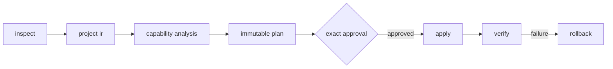

<p align="center">
  
</p>

<h1 align="center">pkgshift</h1>

<p align="center">
  Transactional package manager and runtime migrations for JavaScript repositories.
</p>

<p align="center">
  <a href="https://bahadirarda.github.io/pkgshift/">Website</a> ·
  <a href="https://github.com/bahadirarda/pkgshift/releases">Releases</a> ·
  <a href="docs/index.md">Documentation</a>
</p>

<p align="center">
  <a href="https://github.com/bahadirarda/pkgshift/actions/workflows/ci.yml"></a>
  <a href="https://github.com/bahadirarda/pkgshift/releases"></a>
  
  
  
  
</p>

<p align="center">
  Inspect the repository. Review an immutable plan. Trial it in isolation or approve the exact change. Apply, prove, and roll back from one deterministic CLI.
</p>

> [!NOTE]
> pkgshift is a tested technical MVP. GitHub Releases is the native binary channel; the `pkgshift` and `pkgshift-core` crates are prepared for crates.io but are not published there yet. Registry publication is an explicit, separately approved step because published crate versions are permanent. Both implementations live under `implementations/`: Rust is the primary CLI, while TypeScript remains an executable compatibility reference.

## Install

Install the latest native binary on Linux or macOS with the checksum-verifying shell installer:

```bash
curl --proto '=https' --tlsv1.2 -LsSf https://bahadirarda.github.io/pkgshift/install.sh | sh
```

On Windows x86-64, use the equivalent PowerShell installer:

```powershell
irm https://bahadirarda.github.io/pkgshift/install.ps1 | iex
```

Set `PKGSHIFT_VERSION=v0.20260817.1` on Unix or `$env:PKGSHIFT_VERSION='v0.20260817.1'` on Windows to pin an exact calendar release. `PKGSHIFT_INSTALL_DIR` selects the executable destination and `PKGSHIFT_DATA_DIR` selects the shared portable-skill root. The tracked [shell](site/install.sh) and [PowerShell](site/install.ps1) sources verify the release archive against `SHA256SUMS` before extraction, validate bundled release metadata, install binary and Skill data through staged replacements, and smoke-test the installed CLI.

Download the archive for your platform from [GitHub Releases](https://github.com/bahadirarda/pkgshift/releases), verify it against `SHA256SUMS`, place `pkgshift` on your `PATH`, and retain its canonical `skills/pkgshift` tree beside the executable or in a supported shared-data path. Every release includes Linux x86-64 and ARM64, macOS Intel and Apple silicon, and Windows x86-64 builds with GitHub provenance attestations. Its bundled `release.json` records the calendar version and exact source commit.

The registry package installs with Cargo once the matching version is available on crates.io:

```bash
cargo install pkgshift --locked
```

Cargo distributes the executable crate. Use the native archive or set `PKGSHIFT_DATA_DIR` to a directory containing the canonical `skills/pkgshift` tree when managed Agent Skill commands are required.

To build the current source directly:

```bash
git clone https://github.com/bahadirarda/pkgshift.git
cd pkgshift
cargo install --locked --path implementations/rust/pkgshift-cli
```

## One command from the project root

```console
$ pkgshift to bun
Plan plan_... will migrate pnpm to bun.
Apply this exact plan? [y/N] y
pkgshift to bun: Completed
plan: plan_...
run: run_...
runStatus: succeeded
```

pkgshift detects the current package manager and repository shape automatically. Before approval, it does not persist state or modify the project. After approval, it resolves and validates the exact target executable declared by the plan, stores private recovery data under `.pkgshift/state`, applies the exact plan, runs the target installer without lifecycle scripts, and verifies the result.

Check whether a target is ready before requesting its complete plan:

```bash
pkgshift doctor --to bun
```

Doctor reuses the deterministic migration engine and reports `ready`, `review-required`, `blocked`, or `already-selected` with capability, integration, cleanup, source-artifact retirement, process, and verification evidence. It creates no plan, persists no state, executes no process, and changes no repository file.

When the target is undecided, assess every production adapter from one repository scan:

```bash
pkgshift doctor
```

The returned `migration-readiness-matrix` keeps all seven target reports and their read-only planning actions separate. It does not rank a winner or hide blocked candidates.

```bash
# Read-only human preview
pkgshift to pnpm --dry-run

# Structured agent preview
pkgshift to pnpm --json --no-color --non-interactive
```

Bind optional-package verification to deployment targets and require semantic dependency-edge parity when the repository needs a stronger proof:

```bash
pkgshift to pnpm \
  --target-platform darwin/arm64 \
  --target-platform linux/x64/glibc \
  --edge-equivalence strict
```

The normalized matrix and edge policy participate in the plan identifier and every returned approval action. Without a matrix, pkgshift preserves its compatibility tolerance for optional-only package absence. With a matrix, absence is tolerated only when lockfile constraints prove the package incompatible with every selected target.

Execute the exact plan, native importer, target installer, and verification in a disposable copy before authorizing repository writes:

```bash
pkgshift to pnpm --trial
```

A successful trial returns `repositoryUnchanged: true`, a nested verification report, and no source `runId`. Trial approval covers sandbox process execution only; run the normal preview again before approving apply.

Compare multiple targets before choosing one:

```bash
pkgshift compare bun deno vlt --verify-script test
```

The first call is read-only and returns one aggregate comparison plan. After exact approval, each executable target runs in its own disposable repository copy. The report keeps passed, failed, and capability-blocked candidates separate, proves the source repository stayed unchanged, and does not invent a winner.

Migrate supported Bun application runtime semantics separately from package-manager state:

```bash
pkgshift runtime to deno --deno-permission net
```

The runtime command converts only registered deterministic shapes such as an official Hono-style `Bun.serve` fetch handler, safe `bun:test` imports, Bun text and JSON reads, the shared `bun:sqlite` `Database` subset, Bun's `$` shell template through pinned `jsr:@david/dax@0.49.0`, direct runtime scripts, and Bun type residue. Shell conversion requires explicit `env` and `run` permissions; Bun-only SQLite members remain blocking. Its first call is read-only, its Deno permissions are plan-bound, and its approved transaction has independent verification and `pkgshift runtime rollback`. It does not change `packageManager`, delete `bun.lock`, install dependencies, or ask a model to invent unsupported rewrites.

Select representative root package scripts when application-level proof is required:

```bash
pkgshift to bun --trial --verify-script lint --verify-script test
```

`--verify-script` is repeatable and opt-in. pkgshift verifies that each name exists in the root `package.json`, records the exact target argv and a 300-second ceiling in the immutable plan, then runs it without a shell after the target install. A later `verify <run-id>` evaluates the journaled result and never runs the script again. Selected scripts execute repository code and may create files outside pkgshift's migration snapshot, so use `--trial` first and review each script before approving a normal apply.

## Why pkgshift

A package manager migration is larger than replacing a lockfile. Workspaces, dependency protocols, catalogs, overrides, patches, linker policy, registry configuration, CI, containers, runtime pins, and contributor commands can all carry package-manager semantics.

| Capability | pkgshift behavior |
| --- | --- |
| Repository understanding | Combines manifest, lockfile, workspace, configuration, and integration evidence instead of guessing from one file. |
| Migration readiness | Projects one target or all seven adapters as available, reviewable, blocked, or already selected, including affected paths and declared effects, without creating a plan or writing state. |
| Semantic planning | Builds a versioned Project IR and evaluates every observed capability against the target adapter. |
| Policy translation | Converts supported linker, registry, override, resolution, package-extension, portable text-patch, and lifecycle allow-list semantics into deterministic target configuration. Yarn Modern and pnpm retain exact, range, and name-only semantics; Yarn targets bind non-exact selectors to source-proven exact locators, while Bun remains exact-version only. |
| Approval boundary | Produces an immutable plan identifier and requires approval for that exact plan before mutation. |
| Transactional execution | Rechecks preconditions, snapshots affected files, removes pre-migration package-local dependency state, journals cleanup and process operations, and stops at the first unsafe transition. |
| Verification | Proves the exact target executable, a clean target install, and zero source-only repository artifacts; compares reachable lock resolutions under an optional target-platform matrix and compatible or strict edge policy; checks planned digests, target selection, workspace membership, installer completion, and explicitly selected representative scripts. |
| Isolated trial | Runs the exact accepted plan in a disposable repository copy and proves the source remained unchanged. |
| Target comparison | Binds two or more target plans to one approval, trials every executable candidate in a separate disposable copy, and reports evidence without ranking by guesswork. |
| Runtime recipes | Applies dedicated Bun-to-Deno recipes for HTTP serving, tests, files, the shared SQLite subset, shell templates through dax, scripts, and type residue; blocks unsupported API shapes; verifies zero supported Bun residue; and retains an integrity-checked rollback. |
| Agent Skill lifecycle | Previews and manages project or user Codex and Claude Code destinations through copy or exact-source link ownership, content digests, and protected uninstall. |
| Artifact explanation | Expands every registered diagnostic and loads integrity-checked package-manager or runtime plans, runs, and verification reports without mutation. |
| Recovery | Restores repository files from integrity-checked snapshots and verifies the original fingerprint. |

Unsupported, unknown, unsafe, or unimplemented semantics block execution. pkgshift does not hide uncertainty behind a successful exit code.

## How it works



The normal command orchestrates this pipeline without exposing repository or state paths. `pkgshift doctor --to <target>` projects the same engine's readiness evidence before a plan is requested. Apply resolves the planned target program from `PATH`, runs a bounded `--version` probe, and requires the exact catalog pin before creating a snapshot. Before target import or installation, pkgshift removes every package-local `node_modules` directory recorded by the accepted Project IR and journals whether each path was removed or already absent. Target-native importers then run when available; source-only lockfiles remain until import and installation complete. Context-aware integration adapters update registered package scripts, CI commands and setup actions, cache lockfile references, containers, automation recipes, Markdown command spans, devcontainers, and toolchain pins without rewriting ordinary prose or runtime commands. Verification requires the executable and cleanup records, rejects any remaining source-only lockfile or configuration artifact, and runs only representative root scripts that were explicitly bound into the approved plan. `--trial` executes the same plan and verifier in a disposable copy. Advanced `doctor`, `inspect`, `plan`, `apply`, `verify`, `explain`, and `rollback` commands remain available for integrations that need stage-level control. The Rust primary CLI also owns managed Agent Skill installation, health inspection, and protected uninstall.

## Monorepo layout

Both implementations are deliberately visible under one boundary:

```text
implementations/
├── rust/
│   ├── pkgshift-core/   deterministic migration engine
│   └── pkgshift-cli/    primary executable and agent interface
└── typescript/          executable compatibility and parity reference

docs/                    shared OKF knowledge bundle
site/                    static product website and verified native installers
skills/pkgshift/         shared portable Agent Skill
.changeset/              committed release intent and fixed-group policy
Cargo.toml               Rust workspace orchestration
package.json             polyglot repository orchestration
```

Rust and TypeScript share product terminology, adapter baselines, approval semantics, and the versioned JSON contract. They do not share internal implementation details or call one another at runtime.

| Implementation | Role | Toolchain | Validation boundary |
| --- | --- | --- | --- |
| Rust | Primary product engine and CLI | Rust 1.97.1 | Lock graph format tests, 42-direction planning, policy conversion, subprocess migrations, real Bun, vlt, and Deno acceptance, isolated trial, drift failure, rollback, and release build |
| TypeScript | Executable compatibility and parity reference | Bun 1.3.14, strict TypeScript | Full unit, integration, policy, safety, skill, and real CLI transaction suite |

## Agent workflow

pkgshift is designed for Codex, Claude Code, and other coding agents, but the engine remains deterministic and model-independent.

1. The agent runs read-only doctor for the selected target, or without `--to` to assess every adapter, and presents its readiness evidence.
2. The agent requests a complete read-only structured preview only when migration is available or reviewed lossy behavior is accepted.
3. pkgshift returns exit code `7`, a complete plan, and one exact `nextActions[].argv`.
4. The agent presents the risks and waits for approval.
5. After approval, the agent executes the returned argument array unchanged.
6. pkgshift persists, applies, and verifies the approved plan in one invocation.

```bash
pkgshift doctor --to bun --json --no-color --non-interactive
pkgshift to bun --json --no-color --non-interactive
```

The `migration-readiness` artifact's `migrationAvailable` field is authoritative. A `doctor_...` report identifier is evidence only and cannot authorize planning or mutation.

With no target, consume the `migration-readiness-matrix` reports independently. Top-level completion means the matrix is trustworthy, not that every target is executable. pkgshift never selects or ranks a target.

For target selection, agents can use `pkgshift compare bun deno --json --no-color --non-interactive`, present the aggregate plan, obtain one process-execution approval, and compare the returned candidate reports. A failed or blocked candidate is evidence, not an internal command failure, when the comparison report itself completes and `repositoryUnchanged` is true.

When a user asks for proof before mutation, the agent previews with `--trial`, obtains separate approval for its `process-execution` action, and reports the `trial-report`. A trial never authorizes the later repository-write action.

For Bun-to-Deno application conversion, agents use `pkgshift runtime to deno --deno-permission <name>` and follow the same exact-next-action boundary. Runtime and package-manager plans are separate approvals.

Agents can run `pkgshift explain <diagnostic-code-or-artifact-id>` at any point. The Rust CLI resolves the default `.pkgshift/state` directory or an explicit `--state-dir`, validates stored identities and content digests, and returns no mutation action.

The model does not author migration edits. Detection, capability analysis, recipe selection, transformation, execution, and verification are implemented by pkgshift.

## Package manager support

| Adapter | Tier | Baseline |
| --- | --- | --- |
| npm | Production target | `npm@12.0.2` |
| pnpm | Production target | `pnpm@11.21.0` |
| Yarn Classic | Production target | `yarn@1.22.22` |
| Yarn Modern | Production target | `yarn@4.18.0` |
| Bun | Production target | `bun@1.3.14` |
| vlt | Production target | `vlt@1.0.2` |
| Deno dependency mode | Production target | `deno@2.9.5` |

Both engines cover all 42 basic directions between the seven production adapters at planning level. vlt support includes workspaces, workspace protocols, catalogs, graph modifiers, public registry and scope configuration, command integration rewriting, installation, and vlt lock graph proof. Deno dependency mode includes workspaces, npm-compatible overrides and registry configuration, catalog expansion, isolated linking, preserved runtime configuration, `deno task` integration rewriting, installation, and Deno v5 lock graph proof. Deno dependency mode remains separate from application runtime conversion; the Rust CLI owns the dedicated Bun-to-Deno recipe surface. Unsupported protocols, lifecycle policies, selectors, literal credentials, and configuration outside the deterministic subset fail closed. Every Rust apply resolves and validates the exact target baseline shown above before repository mutation. Rust subprocess fixtures execute vlt and Deno migrations, while pinned real installers validate multi-package workspace migration, lock graph equivalence, and a migrated Hono runtime on Deno 2.9.5. See the [real-world validation corpus](docs/support/real-world-corpus.md) for pinned upstream planning, installer, and verification evidence.

See the full [support policy](docs/support/package-managers.md) and [capability matrix](docs/support/capability-matrix.md).

## Build and validate the monorepo

Requirements: Rust `1.97.1` and Bun `1.3.14` or newer. Bun is used for the TypeScript reference, documentation validation, and workspace orchestration.

```bash
git clone https://github.com/bahadirarda/pkgshift.git
cd pkgshift
bun install --frozen-lockfile
bun run check
bun run build
cargo install --locked --path implementations/rust/pkgshift-cli
```

Then run it from the repository you want to migrate:

```bash
cd /path/to/project
pkgshift doctor --to bun
pkgshift to bun --dry-run
```

## Agent Skill

The portable `pkgshift` Agent Skill teaches coding agents to treat the CLI as the execution boundary and preserve exact approval semantics. Preview a managed project installation, then execute the exact returned action after approval:

```bash
pkgshift skill install --scope project --client codex --mode copy --json --non-interactive
pkgshift skill install --scope project --client codex --mode copy \
  --approve skill_plan_...
```

The Rust CLI supports managed copy and exact-source link modes, read-only `status` and `doctor`, project and user scopes, Codex at `.agents/skills/pkgshift`, Claude Code at `.claude/skills/pkgshift`, and protected uninstall that refuses locally modified copies. Released distributions place the portable source beside the executable's shared data path; source checkouts resolve the repository-owned `skills/pkgshift` directory.

Diagnostic and artifact inspection is also native to the Rust CLI:

```bash
pkgshift explain PM_SOURCE_AMBIGUOUS --json --non-interactive
pkgshift explain run_... --state-dir .pkgshift/state --json --non-interactive
```

Stored plan, run, verification, runtime plan, runtime run, and runtime verification identifiers are loaded through bounded, integrity-checked read-only paths. Invalid, missing, or non-canonical identifiers never become filesystem paths.

## Safety contract

- Inspection, dry-run, and unapproved guided planning are read-only.
- Apply and rollback require artifact-bound approval identifiers.
- Plans bind to the repository fingerprint and exact before/after file digests.
- Recovery snapshots are created before the first repository write.
- Source lock graphs are bound to plans; target graphs are extracted independently after installation. Topology-capable formats use policy-aware `reachable-resolution-set-v3`, while topology-limited formats identify their conservative `resolution-set-v1` fallback explicitly.
- Added, removed, or comparably integrity-mismatched resolutions block successful verification. `--edge-equivalence strict` also makes normalized reachable dependency-edge drift blocking.
- Repeatable `--target-platform OS/CPU[/LIBC]` values make optional-package absence acceptable only when recorded constraints prove incompatibility with every target.
- The target executable path and exact catalog version are resolved before snapshots, stored in the run journal, and checked again by verification.
- Trial sandboxes reject symbolic links and never persist migration state in the source repository.
- Target installs run without a shell and with lifecycle scripts disabled.
- Representative scripts are never inferred; explicitly selected scripts run without a shell, have a fixed timeout, and persist only withheld output metadata. Their repository side effects are not rollback-snapshotted.
- Credentials are redacted from repository evidence, and Rust process output is withheld from persisted artifacts.
- Yarn registry migration accepts authentication only through environment references and never persists literal `.npmrc` tokens.
- Symbolic-link traversal outside the selected repository root is rejected.
- Concurrent apply, verify, and rollback operations are serialized per repository.
- Cleanup accepts only package-local paths ending in `node_modules`, rejects symbolic links and non-directory targets, and executes before the target installer.

Rollback restores repository files. It does not restore the removed pre-migration `node_modules` state, global stores, downloads, or package-manager caches; reinstall the source dependency state after rollback when local dependency parity is required. Successful migration never deletes global package-manager state.

## Development

```bash
bun run check:rust        # rustfmt, clippy, unit tests, and subprocess transactions
bun run check:typescript  # strict types, reference tests, and bundle validation
bun run validate          # OKF, links, Agent Skill, and English-only content
bun run check             # complete polyglot validation suite
bun run build             # Rust release binary and TypeScript reference bundle
bun run changeset         # declare user-visible release intent
bun run changeset:status  # inspect the calculated fixed-group release plan
bun run version:next      # preview the deterministic calendar version
bun run version:check     # synchronized calendar SemVer, package identities, locks, changelog, and release tag
```

Neither implementation delegates repository analysis or edit generation to an AI model.

## Documentation

The `docs/` directory is an [Open Knowledge Format v0.2 bundle](docs/index.md):

- [Product vision](docs/product/vision.md)
- [MVP status](docs/product/mvp-status.md)
- [Migration engine](docs/architecture/migration-engine.md)
- [Agent interface](docs/architecture/agent-interface.md)
- [Recovery and verification](docs/architecture/recovery-and-verification.md)
- [Lock graph proof](docs/architecture/lock-graph-proof.md)
- [Platform, edge, and executable verification](docs/architecture/verification-policies.md)
- [Bun-to-Deno runtime recipes](docs/architecture/runtime-migration-recipes.md)
- [Real-world validation corpus](docs/support/real-world-corpus.md)
- [Package manager workflow](docs/workflows/pkgshift.md)
- [Migration readiness](docs/workflows/migration-readiness.md)
- [Isolated migration trial](docs/workflows/isolated-trial.md)
- [Bun-to-Deno runtime workflow](docs/workflows/runtime-migration.md)
- [Release system](docs/governance/release-system.md)
- [Website delivery](docs/governance/website-delivery.md)

## Current boundaries

`reachable-resolution-set-v3` makes reachable version and comparable integrity drift blocking, prunes proven-unreachable entries, and applies plan-bound platform and edge policies. Compatible mode reports edge-shape differences; strict mode blocks them. Topology-limited formats retain explicit `resolution-set-v1` behavior, and binary `bun.lockb` graph extraction fails closed until converted to text. Patch conversion remains text-only and rejects binary, multiple-source, remote, or unsafe paths; Yarn Modern and pnpm support portable exact, range, and name-only selectors. Yarn targets expand non-exact selectors into exact locators proven by the source manifest or lock graph and fail closed without that evidence; Bun requires exact versions. vlt and Deno are production targets only for their documented deterministic subsets. The separate Rust runtime command supports verified Bun-to-Deno shapes, including the shared `Database` and dax shell subsets, while routes, WebSockets, Bun-only SQLite methods, macros, advanced APIs, and `bunfig.toml` remain blocking. The TypeScript reference remains the renderer parity oracle for package-manager transformation expansion.
